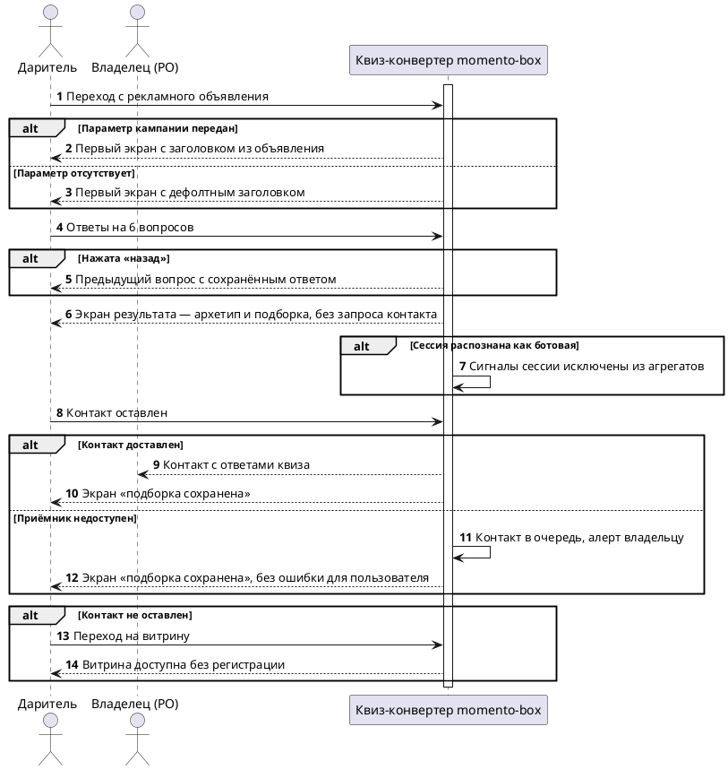

# [БФТ] QUIZ: Квиз-конвертер momento-box

Бизнес описание
===============

**Образ результата:** даритель приходит с рекламного объявления Яндекс.Директа, проходит 6 вопросов (один вопрос на экран, автопереход) и сразу видит именованный архетип и подборку впечатлений (≥5 карточек) без запроса контакта. Даритель может сохранить подборку, переслать её и перейти на витрину впечатлений без регистрации. Оставленный контакт доходит до владельца вместе с ответами квиза; при сбое приёмника контакт уходит в очередь с алертом, пользователь ошибки не видит. Поведение дошедших (просмотр карточки, добавление в подборку) снимается со всех сессий, ботовые сессии исключаются из агрегатов.

**Зачем делать:** сейчас лид оседает в `localStorage` и до владельца не доходит — теряется 100% контактов. Доработка устраняет потерю лидов и превращает рекламный бюджет в структурированные данные о спросе (кто, кому, что, в какую цену) для переговоров с поставщиками. Целевая доходимость холодного мобильного трафика до экрана результата — не ниже 45% (порог уточняется у PO).

Подробный контекст (полное описание для аналитика)

momento-box — один продукт из двух слоёв. Продукт — витрина доступных впечатлений: конечный пользователь (частный даритель или сотрудник компании) заходит и заказывает впечатление. Целевой канал дистрибуции — B2B2E: платящий клиент это работодатель (SMB), который даёт сотрудникам корпоративный бенефит и в любом сценарии сначала хочет увидеть витрину. Роль B2C-трафика из Яндекс.Директа — не канал продаж, а product discovery: найти впечатления, которые люди реально хотят дарить, по поведению на витрине, а не только по выручке (решение PO, диалог 20.07.2026).

Квиз-конвертер построен частично: витрина-конструктор (`constructor.html`) работает с фиксированной ценой, но функция отправки лида не реализована. Предыдущий рекламный тест дал 15 000 ₽ Директа при 0 лидах — тест испорчен оффером «Дари подарки, а не впечатления», отговаривавшим от собственной категории. Трафик около 50 визитов в день классифицирован владельцем как боты и мисклики.

В документе описываются требования к сценариям:
* переход с рекламного объявления и синхронизация первого экрана с текстом объявления;
* прохождение опросника из 6 вопросов с мягким вопросом о бюджете;
* формирование и показ персональной подборки без гейта контактом;
* доставка лида на внешний приёмник с ответами квиза;
* съём поведенческих сигналов и фильтрация ботового трафика;
* переход на витрину впечатлений без регистрации.

Вне границ доработки: приём платежей, каталог партнёрских договорённостей, бронирование и подтверждение визита (proof-of-service), CRM, B2B2E-контур (HR-админка, биллинг с поставщиками, отчётность работодателю), управление рекламными кампаниями в Яндекс.Директе.

Общая информация
================

| Поле | Значение |
| --- | --- |
| Название проекта | momento-box |
| Ответственный за продукт | Aleks (PO) |
| Ответственный за документ | [УТОЧНИТЬ] |
| Задача/Epic Jira | [СОЗДАТЬ эпик] — эпик в трекере не заведён |
| Статус | АНАЛИЗ |
| Системные требования | [УТОЧНИТЬ] — контракты событий и доставки лида вынести в системные требования (СА) |

Заинтересованные стороны
========================

| ФИО | Роль/должность | Контакты |
| --- | --- | --- |
| Aleks | Владелец продукта (PO), потребитель данных о спросе | [УТОЧНИТЬ] |
| [УТОЧНИТЬ] | Разработка (Senior Python/AI) | [УТОЧНИТЬ] |
| [УТОЧНИТЬ] | Юрист (152-ФЗ) | [УТОЧНИТЬ] |

История изменений
=================

| # | Дата | Автор | Суть изменений |
| --- | --- | --- | --- |
| 1 | 24.07.2026 | bft-draft | Создание страницы. Требования сформированы из концепта и вердикта обсуждения (итерация 2). |

Дополнительные материалы и артефакты
====================================

| Артефакт/Файл/Ссылка | Описание |
| --- | --- |
| Сводная база знаний исследования momento-box (24.07.2026) | Рынок, юнит-экономика, воронка Директ → квиз → витрина, виральность результата, риск-реестр |
| Вердикт обсуждения концепта, итерация 2 (24.07.2026) | Принятый концепт с правками P-1…P-11 |

Проблема которую решаем
=======================

| Срез | Содержание |
| --- | --- |
| **ДЛЯ КОГО** | Владелец momento-box (потребитель лидов и данных о спросе); частный даритель, пришедший с рекламы за подбором подарка |
| **ЧТО ДЕЛАЕМ** | Достраиваем квиз-конвертер: гарантированная доставка лида, съём поведенческого сигнала со всех дошедших, показ подборки без гейта контактом, переход на витрину |
| **ASIS** | <ul><li>Витрина-конструктор работает, фиксированная цена (`constructor.html`, осмотр 20.07.2026)</li><li>Функция отправки лида не реализована — лид оседает в `localStorage` и до владельца не доходит (подтверждено владельцем, 20.07.2026)</li><li>Трафик около 50 визитов в день — боты и мисклики; тест 15 000 ₽ Директа дал 0 лидов, оффер отговаривал от категории (подтверждено владельцем, 20.07.2026)</li></ul> |
| **ПРОБЛЕМА** | <ul><li>Лиды не доходят до владельца — любой трафик слеп по контуру контактов</li><li>Рекламный бюджет не приносит знаний: поведение дошедших не снимается</li><li>Первый экран не синхронизирован с объявлением — главный рычаг доходимости не задействован</li><li>Ботовый трафик не отделён от живого — метрики зашумлены</li></ul> |
| **TOBE** | <ul><li>Каждый оставленный контакт доходит до владельца с ответами квиза</li><li>Поведенческий сигнал снимается со всех дошедших и агрегируется по впечатлениям</li><li>Подборка показывается без гейта контактом, переход на витрину доступен без регистрации</li><li>Ботовые сессии исключаются из агрегатов</li></ul> |

Изменение в UJM
===============

| Точка демо | Было (As-Is) | Стало (To-Be) |
| --- | --- | --- |
| Переход с объявления на первый экран | Заголовок статичный, не связан с текстом объявления | Заголовок дословно повторяет текст объявления (message match), подставляется из параметра кампании |
| Прохождение квиза | Квиз построен частично, вопрос о бюджете отталкивает часть трафика | 6 вопросов, один на экран, автопереход; вопрос о бюджете мягкий, с опцией «Пока не решил(а)» |
| Экран результата | Подборка не показывается до контакта | Именованный архетип и подборка ≥5 карточек сразу, до запроса контакта |
| Запрос контакта | Лид оседает в `localStorage`, до владельца не доходит | Контакт отдельным пропускаемым блоком под подборкой; доходит до владельца, при сбое приёмника уходит в очередь с алертом |
| Переход на витрину | — | Доступен без регистрации и без оставленного контакта |
| Съём поведенческого сигнала | Поведение дошедших не снимается | Просмотр карточки и добавление в подборку фиксируются, ботовые сессии отфильтрованы |

План демонстрации
=================

### Акторы

| Актор | Описание |
| --- | --- |
| Даритель | Частное лицо с рекламного объявления с намерением выбрать подарок |
| Получатель | Третье лицо, для которого подбирается впечатление; не пользователь системы, согласия не давал |
| Владелец (PO) | Потребитель лида и данных о спросе, ведёт переговоры с поставщиками |
| Приёмник лида | Внешняя система доставки контакта (канал уточняется) |

### Сценарий приёмки (happy path + alt)

Сценарий на уровне актор → действие → результат. Квиз-конвертер показан как чёрный ящик, без вызовов между внутренними сервисами и без имён сообщений. При публикации блок рендерится картинкой-вложением.

Атрибутивный состав сообщений (параметры и типы событий лида и сигнала) в БФТ не входит — это зона системных требований (СА).

Бизнес-Требования
=================

## Вводные для разрабатываемого функционала*

Открытые вопросы и зафиксированные решения от стейкхолдеров. Незакрытое — строка с пустым «Ответ» и `[УТОЧНИТЬ]`; полученный ответ вписан в те же колонки.

| Информация или вопрос | Конспект | Ответ | В рамках чего был получен ответ | Кто ответил | Дата |
| --- | --- | --- | --- | --- | --- |
| Канал доставки лида и срок реализации | Telegram-бот / Google Sheets / CRM — вариант не выбран; блокирует ФТ-1 | [УТОЧНИТЬ] | — | Разработка / PO | — |
| 152-ФЗ по профилю получателя | Допустима ли связка «контакт дарителя + категориальный профиль получателя»; является ли комбинация категорий квази-идентификатором; допустимо ли имя получателя на карточке. Блокирует БТ-5 и ФТ-14 | [УТОЧНИТЬ] | — | Юрист | — |
| Определение лид-магнита | Что именно обещаем дарителю за контакт | [УТОЧНИТЬ] | — | PO | — |
| Пороговое N выборов для статуса «валидно» | Число выборов по впечатлению для перевода demand_rank в «валидно» | [УТОЧНИТЬ] | — | PO | — |
| Порог удержания карточки для сигнала просмотра | 2 сек взяты как гипотеза, калибровать на первых сессиях | [УТОЧНИТЬ] | — | PO / аналитика | — |
| Целевая доходимость 45% | Принять как порог или пересчитать на своих данных | [УТОЧНИТЬ] | — | PO | — |
| Ключ эпика и страница wiki | Эпик в трекере не заведён, страница wiki не создана | [УТОЧНИТЬ] | — | PO | — |
| Корпоративный реестр НФТ | При наличии реестра НФТ брать нефункциональные требования оттуда | [УТОЧНИТЬ] | — | PO | — |
| Поддерживаемые браузеры и версии | Список для адаптива от 360 px | [УТОЧНИТЬ] | — | PO / аналитика | — |
| Горизонт жизни B2C-discovery | При развороте в B2B2E механика подбора «для другого» не переносится (риск) | [УТОЧНИТЬ] | — | PO | — |
| Гейтить ли результат контактом | Показывать подборку до или после запроса контакта | Не гейтить: подборка показывается до запроса контакта | Диалог с PO | Aleks (PO) | 24.07.2026 |
| Роль demand_rank | Самостоятельный аргумент в переговорах или поддержка оффера | Поддержка CPA-оффера, не самостоятельный аргумент; отсутствие demand_rank не блокирует переговоры (правка P-7) | Вердикт обсуждения, итерация 2 | PO | 24.07.2026 |
| Тип гейта валидности demand_rank | Блокирующий или маркирующий | Маркирующий, не блокирующий (правка P-9) | Вердикт обсуждения, итерация 2 | PO | 24.07.2026 |
| Основной сигнал для demand_rank | Просмотр карточки или добавление в подборку | Добавление в подборку, не просмотр (правка P-6) | Вердикт обсуждения, итерация 2 | PO | 24.07.2026 |
| Состав релиза 1 | Что входит в первый релиз | Без контура счётчиков выбора: доставка лида, квиз, экран результата, пассивные сигналы | Рекомендация обсуждения, итерация 2 | PO | 24.07.2026 |
| Роль B2C-трафика | Канал продаж или product discovery | Product discovery, не канал продаж | Диалог с PO | Aleks (PO) | 20.07.2026 |

## Ценность разрабатываемого функционала для бизнес-заказчиков*

| Идентификатор | Наименование требования | Ценность разрабатываемого функционала для бизнес-заказчиков | Краткое описание доработки из данного БФТ | Связанные требования |
| --- | --- | --- | --- | --- |
| БТ-1 | Доставка лида | Устраняет полную потерю контактов: сейчас 100% лидов оседает в `localStorage` | Каждый оставленный контакт доходит до владельца с сохранением ответов квиза | ПТ-2, ФТ-1, НФТ-3, НФТ-4 |
| БТ-2 | Обмен бюджета на знание о спросе | Рекламный бюджет даёт структурированные данные (кто, кому, что, в какую цену), а не только расход | Поведенческий сигнал снимается со всех дошедших и агрегируется по впечатлениям | ПТ-1, ПТ-3, ФТ-6, ФТ-7, ФТ-12 |
| БТ-3 | Доходимость воронки | Без доходимости в целевом коридоре собранные данные нерепрезентативны и вводят в заблуждение | Путь «клик → результат» спроектирован под холодный мобильный трафик | ПТ-1, ФТ-2, ФТ-4, ФТ-5, НФТ-1, НФТ-2 |
| БТ-4 | Витрина «товаром лицом» | Работодатель в B2B2E-канале требует показать, что получат сотрудники, до обсуждения условий | Переход с экрана результата на витрину доступен без регистрации | ПТ-4, ИТ-3, ФТ-4 |
| БТ-5 | Органическое распространение подборки | Снижение стоимости привлечения за счёт пересылок: K-фактор 0,2–0,6 вдвое снижает blended CAC | Подборка спроектирована как объект пересылки в приватных каналах; блокировано заключением по 152-ФЗ | ПТ-2, ФТ-14, НФТ-8 |

Пользовательские требования*
============================

| Идентификатор | Наименование требования | Story | Комментарий | Связанные требования |
| --- | --- | --- | --- | --- |
| ПТ-1 | Подбор под конкретного человека | **Когда** я (даритель) не знаю, что подарить близкому, **Я хочу** за минуту получить подборку под его характер и повод, **Чтобы** не промахнуться с подарком | Приоритет фильтров: характер, затем формат, затем бюджет | БТ-2, БТ-3, ФТ-2 |
| ПТ-2 | Сохранение и пересылка подборки | **Когда** я получил подборку, **Я хочу** сохранить её и переслать, **Чтобы** не потерять и спросить мнение | Пересылка в приватных каналах, 84% шеринга — dark social | БТ-1, БТ-5, ФТ-4, ФТ-14 |
| ПТ-3 | Данные о спросе для переговоров | **Когда** я (владелец) веду переговоры с поставщиком, **Я хочу** показать структуру спроса на его услугу, **Чтобы** подкрепить предложение о комиссии | demand_rank — поддержка CPA-оффера, не самостоятельный аргумент | БТ-2, ФТ-12, ФТ-13 |
| ПТ-4 | Демонстрация каталога | **Когда** я (работодатель) рассматриваю бенефит, **Я хочу** увидеть каталог впечатлений без регистрации, **Чтобы** понять, что получат сотрудники | Канал B2B2E | БТ-4, ФТ-4 |

Требования к интерфейсам*
=========================

Продукт: веб, мобильный веб приоритетен (основной источник трафика — Яндекс.Директ), адаптив от 360 px, поддерживаемые браузеры уточняются. ИТ описывает интерфейс приёмки: что видит и может сделать актор на экране и в результате. Контракты событий и API — зона системных требований (СА).

| Идентификатор | Наименование требования | Требование к пользовательскому интерфейсу | Предложения по элементам UI, механике и композиции | Связанные требования |
| --- | --- | --- | --- | --- |
| ИТ-1 | Первый экран квиза | Заголовок дословно повторяет текст объявления; при отсутствии параметра кампании показывается дефолтный заголовок | Первый вопрос с иконками, без ввода текста; прогресс-бар с позитивной формулировкой | ПТ-1, ФТ-5 |
| ИТ-2 | Экран результата | Именованный архетип, подборка не менее 5 карточек, кнопка сохранения подборки, переход на витрину. Запрос контакта отдельным блоком под подборкой, не блокирует её | Мид-микро-награда и превью результата перед блоком контакта | ПТ-1, ПТ-2, ФТ-4 |
| ИТ-3 | Витрина без регистрации | Переход с экрана результата на витрину доступен без оставленного контакта и без регистрации | Кнопка перехода видна на экране результата рядом с подборкой | БТ-4, ПТ-4, ФТ-4 |

## Макеты интерфейса*

Макеты первого экрана, экрана результата и блока контакта — [УТОЧНИТЬ]: готовность макетов и дизайнер не определены.

Функциональные требования*
==========================

| Идентификатор | Наименование требования | Приоритет | Функциональные требования | Параметры, ограничения | Связанные требования |
| --- | --- | --- | --- | --- | --- |
| ФТ-1 | Доставка лида | Высокий | При отправке формы контакта система отправляет лид на внешний приёмник. При сбое — повтор; при исчерпании повторов — сохранение в очередь и алерт | Релиз 1. Канал уточняется. Повторы до 3, экспоненциальная пауза | БТ-1, ИТ-2, НФТ-3, НФТ-4 |
| ФТ-2 | Опросник из 6 вопросов | Высокий | Порядок: кому, какой человек, повод, формат, бюджет, куда прислать. Один вопрос на экран, автопереход после выбора | Релиз 1. Ровно 6 вопросов. Первый вопрос с иконками, без ввода текста | БТ-3, ПТ-1, НФТ-1 |
| ФТ-3 | Мягкий вопрос о бюджете | Высокий | Вопрос о бюджете показывается пятым, диапазонами, с обязательной опцией «Пока не решил(а)». Опция не исключает пользователя из подбора | Релиз 1. Позиция фиксирована: не первый и не последний | БТ-3, ФТ-2 |
| ФТ-4 | Результат без гейта контактом | Высокий | Подборка показывается сразу после последнего вопроса, до запроса контакта. Запрос контакта — отдельным пропускаемым блоком под подборкой | Релиз 1. Пропуск контакта не блокирует переход на витрину | БТ-3, БТ-4, ИТ-2, ИТ-3 |
| ФТ-5 | Синхронизация первого экрана с объявлением | Высокий | Заголовок первого экрана подставляется из параметра рекламной кампании; при отсутствии — дефолтный заголовок | Релиз 1. Список соответствий «кампания → заголовок» конфигурируется без релиза | БТ-3, ИТ-1 |
| ФТ-6 | Сигнал добавления в подборку | Высокий | При добавлении впечатления в собираемую подборку система фиксирует сигнал добавления | Релиз 1. Основной сигнал для demand_rank (правка P-6) | БТ-2, НФТ-7 |
| ФТ-7 | Сигнал просмотра карточки | Средний | Система фиксирует просмотр при удержании карточки в области видимости дольше порога | Релиз 1. Порог уточняется, стартовое значение 2 сек | БТ-2, НФТ-5, НФТ-7 |
| ФТ-8 | Дедупликация и фильтрация сигналов | Высокий | Сигнал засчитывается не более одного раза на пару «сессия + карточка». Ботовые сессии исключаются из агрегатов | Релиз 1. Критерии бота — НФТ-6 | БТ-2, НФТ-5, НФТ-6 |
| ФТ-9 | Возврат и сохранение прогресса | Средний | Кнопка «назад» возвращает к предыдущему вопросу с сохранением ответа. При закрытии вкладки прогресс восстанавливается в течение сессии | Релиз 1. Сохранение на стороне клиента до финала | БТ-3, ФТ-2 |
| ФТ-10 | Режим деградации по ПДн | Средний | Конфигурационный флаг отключает связку «контакт и категориальный профиль получателя»: профиль сохраняется только в обезличенном агрегате | Релиз 1. Переключение без релиза | БТ-2, НФТ-8 |
| ФТ-11 | Принудительный выбор с ротацией | Средний | На экране результата предлагается выбрать одно впечатление из трёх. Варианты отбираются из подборки с выравниванием счётчика показов. Отказ не прерывает сценарий | Релиз 2. Разброс показов — НФТ-9. Шаг необязателен (правка P-1) | БТ-2, ПТ-3, НФТ-9 |
| ФТ-12 | Расчёт demand_rank | Средний | Показатель спроса demand_rank рассчитывается как отношение числа выборов к числу показов по каждому впечатлению за период | Релиз 2. Нормализация по показам обязательна (правка P-10) | БТ-2, ПТ-3, НФТ-10 |
| ФТ-13 | Маркировка достоверности demand_rank | Средний | Каждая выгрузка demand_rank сопровождается статусом «предварительно» или «валидно» с указанием текущей доходимости и N | Релиз 2. Маркирующий, не блокирующий гейт (правка P-9) | ПТ-3, ФТ-12, НФТ-10 |
| ФТ-14 | Карточка подборки для пересылки | Низкий | Формирование изображения подборки в вертикальном формате с уникальной ссылкой возврата | Релиз 2. Формат 9:16. Состав полей блокирован заключением по 152-ФЗ | БТ-5, ПТ-2, НФТ-8 |

Нефункциональные требования*
============================

Приоритет — брать из корпоративного реестра НФТ при его наличии (уточняется у PO).

| Идентификатор | Наименование требования | Описание | Связанные требования |
| --- | --- | --- | --- |
| НФТ-1 | Скорость загрузки | LCP не более 2,5 сек на мобильном устройстве, перцентиль P75 | БТ-3, ФТ-2 |
| НФТ-2 | Доходимость | Доля дошедших до экрана результата от начавших квиз не ниже 45%, замер на скользящем окне 7 дней. Порог подлежит пересчёту на собственных данных (уточняется у PO) | БТ-3, ФТ-2 |
| НФТ-3 | Надёжность доставки лида | 100% успешно принятых лидов подтверждаются приёмником. Повтор при сбое до 3 раз. Алерт при доле ошибок более 5% за час | БТ-1, ФТ-1 |
| НФТ-4 | Идемпотентность лида | Повторная отправка лида с одним идентификатором не создаёт дубликат на приёмнике | БТ-1, ФТ-1 |
| НФТ-5 | Порог сигнала просмотра | Просмотр засчитывается при удержании не менее 2 сек в области видимости, не более 1 раза на пару «сессия + карточка». Значение калибруется на первых 100 сессиях | ФТ-7, ФТ-8 |
| НФТ-6 | Фильтрация ботового трафика | Сессия исключается из агрегатов при любом из условий: время на странице менее 3 сек, отсутствие событий скролла, совпадение User-Agent со списком известных ботов | ФТ-8 |
| НФТ-7 | Логирование без чувствительных данных | События поведенческого сигнала не содержат имени, контакта и иных идентифицирующих признаков. Срок хранения сырых событий 180 дней | ФТ-6, ФТ-7 |
| НФТ-8 | Обезличенность профиля получателя | Профиль получателя хранится только категориально (тип характера, диапазон бюджета, повод). Идентифицирующие признаки не сохраняются. Допустимая гранулярность категорий уточняется у юриста | ФТ-10, ФТ-14 |
| НФТ-9 | Балансировка экспозиции | Разброс числа показов между карточками одной подборки не более 20% на окне 7 дней | ФТ-11 |
| НФТ-10 | Порог валидности demand_rank | Статус «валидно» присваивается при одновременном выполнении: N выборов по впечатлению не ниже порога (уточняется у PO) и доходимость не ниже НФТ-2 | ФТ-12, ФТ-13 |
| НФТ-11 | Нагрузка | Предварительно 5 RPS на запись событий, 20 RPS на чтение витрины. Подтверждённых данных о пиковой нагрузке нет | ФТ-1, ФТ-7 |
| НФТ-12 | Сквозная трассировка | Каждое событие содержит единый идентификатор сессии от первого экрана до отправки лида | ФТ-1 |

Зависимости
===========

| Команда / система | Тип зависимости | Статус согласования |
| --- | --- | --- |
| Разработка (Senior Python/AI) | Реализация приёмника и доставки лида | Требует согласования — канал доставки не выбран |
| Юрист | Заключение по 152-ФЗ (связка контакт и профиль получателя, комбинаторная идентифицируемость, имя на карточке) | Не запрошено — блокирует БТ-5 и ФТ-14 |
| Яндекс.Директ | Передача параметров кампании в URL | Настройка на стороне рекламного кабинета, вне границ системы |

Риски
=====

| Риск | Вероятность | Влияние | Митигация |
| --- | --- | --- | --- |
| Заключение юриста по 152-ФЗ ограничительное — виральный контур невозможен | Средняя | Отпадает БТ-5 | ФТ-10: деградация до обезличенного режима конфигурацией, без рефакторинга |
| Доходимость не достигает 45% — demand_rank навсегда «предварительно» | Средняя | БТ-2 не выполняется | Маркирующий, а не блокирующий гейт (ФТ-13); пересчёт порога на своих данных |
| Данные о намерении без данных о конверсии работают против нас в переговорах | Средняя | Ущерб переговорной позиции | Роль demand_rank понижена до поддержки CPA-оффера (правка P-7), переговоры не блокируются его отсутствием |
| Popularity bias в отборе вариантов | Высокая без митигации | Искажение всего сигнала | Ротация с балансировкой экспозиции (ФТ-11, НФТ-9) |
| Сравнение старых и новых карточек по абсолютным числам | Высокая без митигации | Систематическое занижение нового | Нормализация по показам (ФТ-12) |
| При развороте в B2B2E механика подбора «для другого» не переносится: сотрудник выбирает себе | Средняя | Списание работ по B2C-контуру | Назвать горизонт жизни B2C-discovery явно (уточняется у PO) |

Ревью требований
================

* Продакт — Aleks
* Архитектор — [УТОЧНИТЬ]
* Аналитик (кросс-ревью) — [УТОЧНИТЬ]
* Разработка — Senior Python/AI
* Тестирование — [УТОЧНИТЬ]
* Юрист (152-ФЗ) — [УТОЧНИТЬ], не запрошено

Якоря истины
============

| Факт в БФТ | Источник (якорь) | Ранг | Тип |
| --- | --- | --- | --- |
| Функция отправки лида не реализована, лид оседает в `localStorage` | Подтверждено владельцем, диалог 20.07.2026 | R3 | Решение PO |
| Витрина-конструктор существует, фиксированная цена | `constructor.html`, осмотр 20.07.2026 | R1 | Код (As-Is) |
| 15 000 ₽ Директа дали 0 лидов, оффер отговаривал от категории | Подтверждено владельцем, диалог 20.07.2026 | R3 | Решение PO |
| Трафик около 50 визитов в день — боты и мисклики | Подтверждено владельцем, диалог 20.07.2026 | R3 | Решение PO |
| Доходимость холодного платного трафика 35–50% | База знаний исследования momento-box, раздел «Воронка» | R2 | Артефакт исследования |
| Вопрос о бюджете даёт до 30% отвала | База знаний исследования momento-box, раздел «Воронка» | R2 | Артефакт исследования |
| Показ результата без гейта контактом — 6% отказов | База знаний исследования momento-box, раздел «Воронка» | R2 | Артефакт исследования |
| 84% шеринга идёт через приватные каналы; K-фактор 0,2–0,6 | База знаний исследования momento-box, раздел «Виральность» | R2 | Артефакт исследования |
| Правки P-1…P-11 | Вердикт обсуждения концепта, итерация 2, 24.07.2026 | R2 | Артефакт обсуждения |
| Роль B2C-трафика — product discovery | Подтверждено владельцем, диалог 20.07.2026 | R3 | Решение PO |
| Не гейтить результат контактом | Решение PO, диалог 24.07.2026 | R3 | Решение PO |

Корпоративная wiki и трекер в проекте отсутствуют, ключ эпика и страница wiki уточняются. Ранги адаптированы: R2 трактуется как документированный артефакт проекта с датой, R3 — решение владельца с указанием даты диалога. To-Be требования заякорены на решения PO и артефакты обсуждения (R2/R3), не на код.
