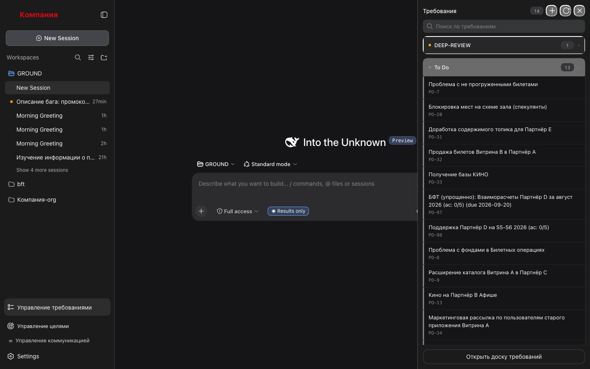
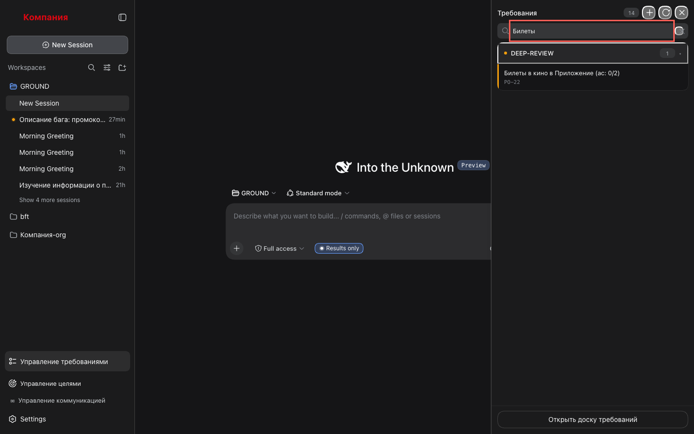

# 1. Список требований

Открыть очередь БФТ, сориентироваться по стадиям и найти нужное.

## Шаги

### 1. Открой раздел

Нажми **«Управление требованиями»** в подвале левой панели. Справа появится панель
«Требования» со счётчиком — сколько требований сейчас в очереди.

В шапке три кнопки: **«+»** (новая инициатива, см. сценарий 6), **«Обновить»**
(синхронизация с таблицей, см. сценарий 5) и **«Закрыть»**.

### 2. Прочитай группы

Требования сгруппированы по стадиям пайплайна. Порядок — рабочий, а не хронологический:
чем ближе к финалу, тем выше, потому что то, что почти готово, требует внимания первым.
Отменённые и завершённые (`DEEP-DONE`) в очереди не показываются — они есть на доске.

У каждой группы — цветная точка стадии и счётчик. Нажми на заголовок группы, чтобы
свернуть её; повторное нажатие разворачивает.

### 3. Найди требование

Набери часть названия или идентификатор в поле **«Поиск по требованиям»** — в списке
останутся только совпадения, пустые группы исчезнут.

Ничего не нашлось — появится «Ничего не найдено» и кнопка «Сбросить поиск». Крестик в
поле поиска очищает запрос.

### 4. Закрой панель

**«Закрыть»** в шапке. При следующем открытии список снова развёрнут и без фильтра —
свёрнутость и поиск не запоминаются намеренно.

## Что стоит знать

- Список кэшируется в браузере: при повторном открытии он показывается сразу, а в фоне
  тихо обновляется. Спиннер — только при самом первом открытии.
- Ошибка чтения (`backlog` не установлен, воркспейс не найден) показывается текстом как
  есть и кнопкой «Повторить».
