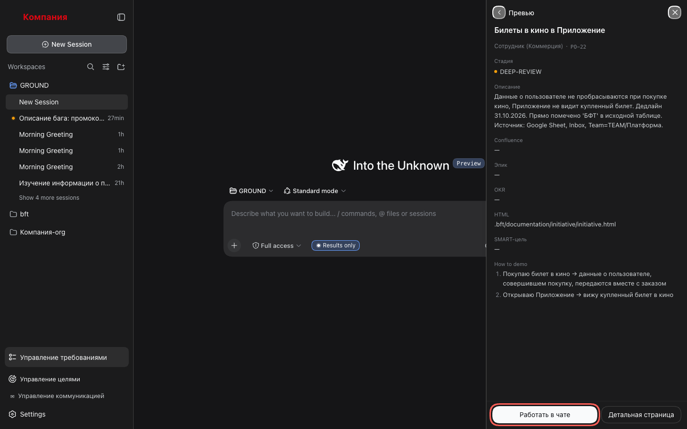
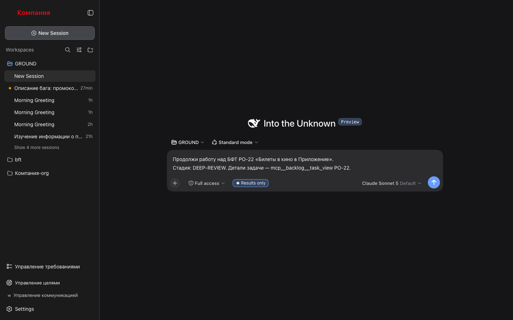

# 2. Превью и работа в чате

Посмотреть карточку требования и продолжить работу над ним в чате с агентом.

## Шаги

### 1. Открой превью

В списке нажми на строку требования. Панель переключится в превью: название, стадия,
описание, SMART-цель, How to demo и ссылки (Confluence, эпик, OKR, HTML-документ), если
они записаны в задаче.



### 2. Продолжи в чате

Нажми **«Работать в чате»**. Откроется чат рабочего пространства, а в композере уже будет
черновик:

```
Продолжи работу над БФТ PO-22 «Билеты в кино в Vibe App».
Стадия: DEEP-REVIEW. Детали задачи — mcp__backlog__task_view PO-22.
```

Ничего не отправлено — прочитай, поправь, если нужно, и нажми Enter сам.



### 3. Вернись

**«Назад к списку»** (стрелка в шапке превью) возвращает к очереди. **«Детальная
страница»** ведёт к документу требования — это сценарий 3.

## Что стоит знать

- Если требование удалили из Backlog.md, пока превью было открыто, панель скажет об этом
  и предложит вернуться к списку.
- Панель закрывается только после того, как чат открылся. Не открылся (нет рабочего
  пространства, служба чата недоступна) — панель остаётся, причина в консоли браузера.
