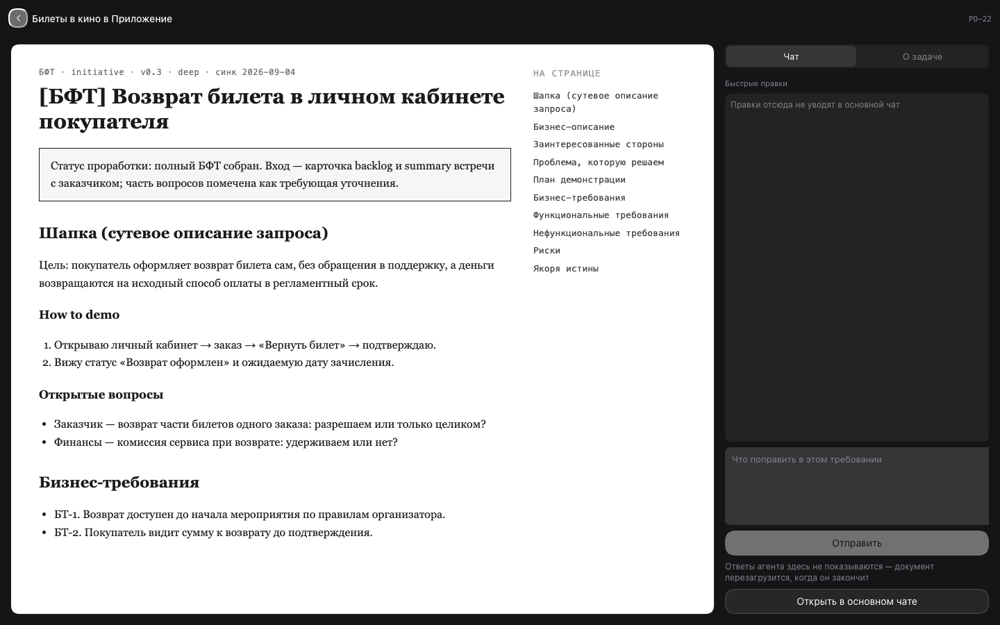
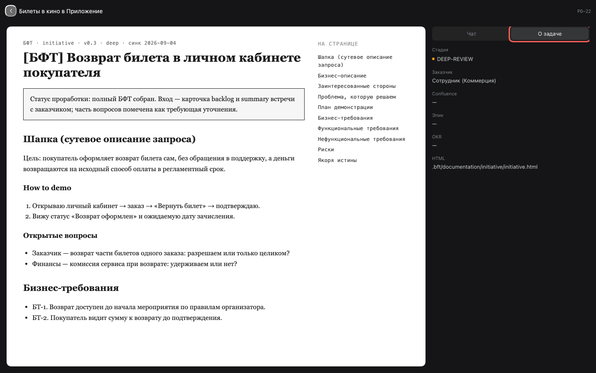
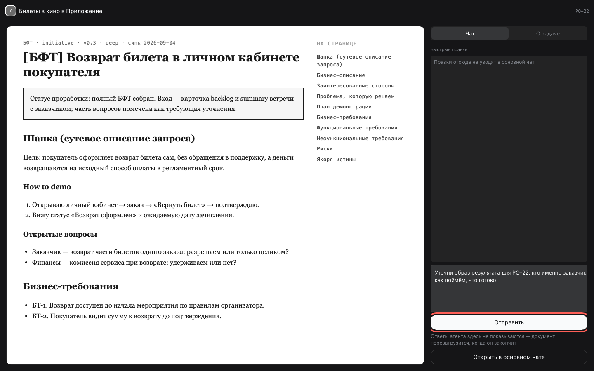

# 3. Детальная страница

Прочитать документ требования, посмотреть ключевые поля и отправить агенту правку, не
уходя со страницы.

## Шаги

### 1. Открой страницу

Из превью нажми **«Детальная страница»** (или нажми карточку на доске — сценарий 4).
Страница занимает весь экран: слева документ требования, справа колонка с двумя
вкладками — **«Чат»** и **«О задаче»**.

Документ на снимках — демонстрационный: настоящие документы требований внутренние и в
публичные картинки не попадают.

Документ ищется в `.bft/documentation/` по идентификатору требования. Документа нет —
слева будет «Документа нет» и кнопка **«Создать документ»**: она кладёт в чат черновик
`/bft-fast <id> «название»`.

### 2. Посмотри поля

Вкладка **«О задаче»** — те же поля, что в превью: стадия, описание, SMART-цель, How to
demo, ссылки, заказчик.

### 3. Отправь правку

Вкладка **«Чат»** → блок «Быстрые правки». Напиши, что поправить в требовании, и нажми
**«Отправить»**. Правка уйдёт агенту в сессию этого требования; страница остаётся открытой.

Важно: **ответы агента здесь не показываются** — только статус «Агент работает…». Когда
он закончит, документ слева перезагрузится. Прочитать ответ можно по кнопке
**«Открыть в основном чате»**.

### 4. Вернись

**«Назад»** возвращает туда, откуда пришёл: в превью или на доску.

## Что стоит знать

- Сессия требования заводится один раз и переиспользуется: повторные правки уходят в тот
  же диалог, а не плодят новые чаты.
- Чаты по требованиям привязаны к рабочему пространству `bft` внутри воркспейса, а не к
  текущему рабочему пространству харнесса — так они собираются отдельной группой.
