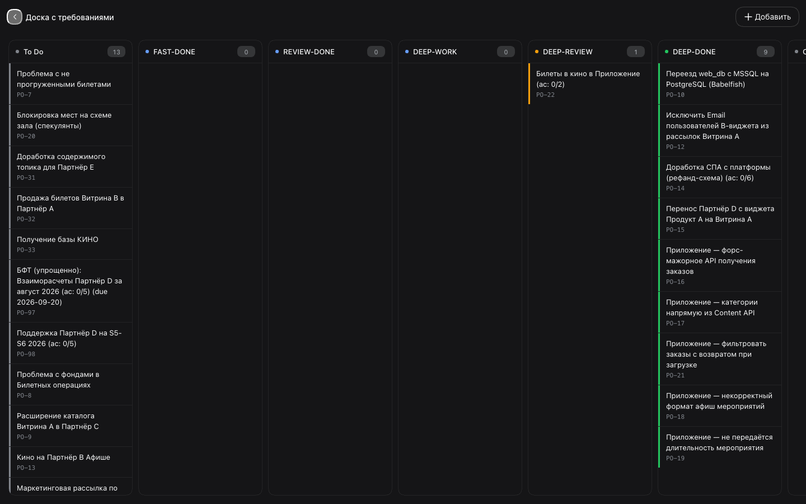
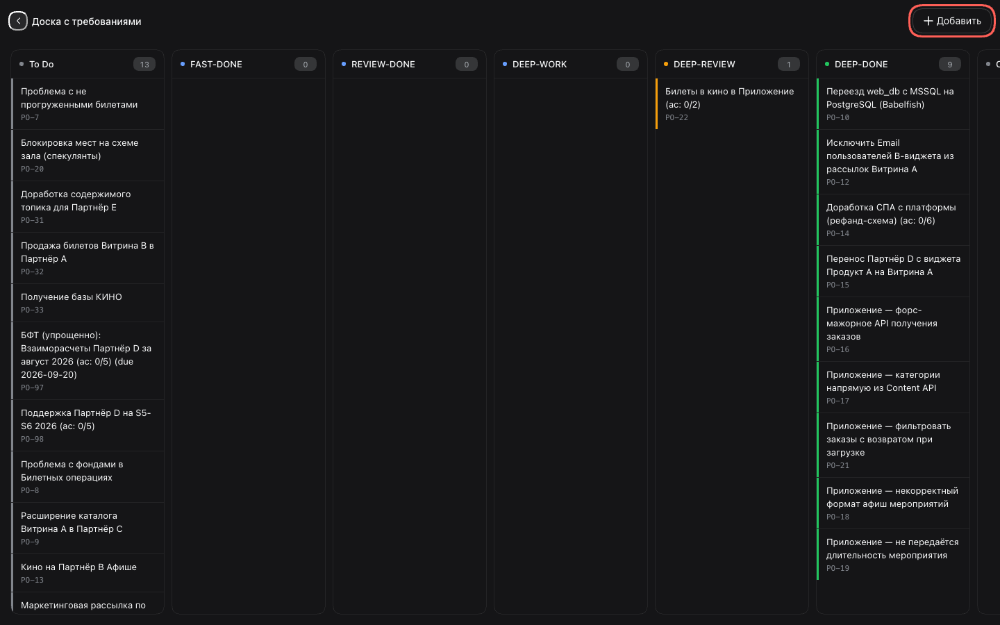

# 4. Доска по стадиям

Увидеть весь пайплайн БФТ целиком — включая завершённые и отменённые, которых нет в
очереди панели.

## Шаги

### 1. Открой доску

Внизу панели «Требования» нажми **«Открыть доску требований»**. Доска занимает весь
экран: семь колонок в порядке пайплайна, у каждой — счётчик.

```
To Do → FAST-DONE → REVIEW-DONE → DEEP-WORK → DEEP-REVIEW → DEEP-DONE → Cancelled
```



Пустые колонки тоже показываются — с нулём. Так видно, где пайплайн пуст, а не только
где есть работа.

### 2. Открой карточку

Нажми карточку — откроется детальная страница этого требования (сценарий 3). **«Назад»**
на ней вернёт на доску, а не в список.

### 3. Заведи инициативу

**«Добавить»** в правом углу шапки открывает форму сбора инициативы на всю страницу.
Кнопка активна, только если в настройках задана ссылка на форму — иначе она погашена, а
подсказка по наведению говорит, где её задать. Подробности — сценарий 6.



### 4. Вернись к списку

Стрелка **«←»** в шапке доски возвращает панель к очереди.

## Что стоит знать

- Доска грузит список сама при каждом открытии — она не зависит от того, что успела
  загрузить панель. Кэш браузера общий, поэтому первая отрисовка мгновенная.
- Колонки не сжимаются под узкий экран: если их не вместить, доска скроллится по
  горизонтали целиком.
