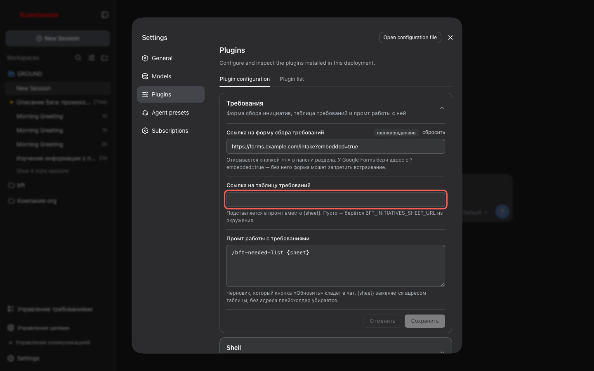
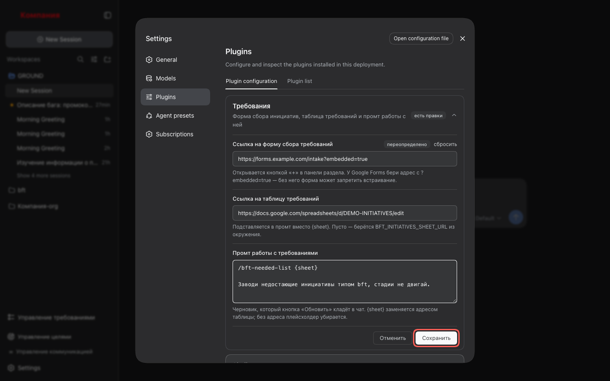
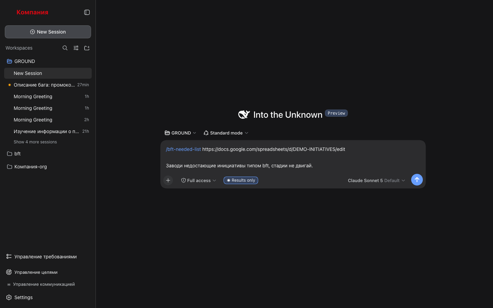

# 5. Синхронизация с таблицей инициатив

Подтянуть новые инициативы из таблицы в Backlog.md. Раздел таблицу не читает — это
делает агент по промту; раздел только собирает для него готовый черновик.

## Шаги

### 1. Укажи таблицу и промт

Открой **Настройки → Плагины**, разверни карточку **«Требования»**.



Заполни два поля:

- **Ссылка на таблицу требований** — адрес Google Sheet с инициативами.
- **Промт работы с требованиями** — по умолчанию `/bft-needed-list {sheet}`.
  `{sheet}` заменится адресом таблицы; промт можно переписать под себя, в несколько
  строк.

Нажми **«Сохранить»**. Пока поле не проходит проверку (адрес не с `http://`/`https://`),
кнопка заблокирована, а под полем — причина.



### 2. Запусти синхронизацию

Открой панель «Требования» и нажми **«Обновить»** в шапке. Откроется чат, в композере —
промт с подставленным адресом:

```
/bft-needed-list https://docs.google.com/spreadsheets/d/…
```



Enter отправляет — агент сверит таблицу с Backlog.md, заведёт недостающие задачи и
подвинет стадии. Ничего не отправляется само.

### 3. Обнови список

Когда агент закончит, открой панель заново — список перечитывается при каждом открытии.

## Что стоит знать

- Пусто в «Ссылка на таблицу требований» — берётся `BFT_INITIATIVES_SHEET_URL` из
  окружения харнесса. Поле в настройках при этом помечено как переопределённое, если ты
  его задавал, и «сбросить» возвращает значение из окружения.
- Пусто и там, и там — черновик уйдёт без адреса (`/bft-needed-list`), и агент спросит
  его сам. Пустых скобок и двойных пробелов в черновике не будет.
- Промт правится с другой поверхности (другой браузер, файл настроек) — карточка покажет
  актуальное значение сразу, несохранённые правки при этом не пропадут.
