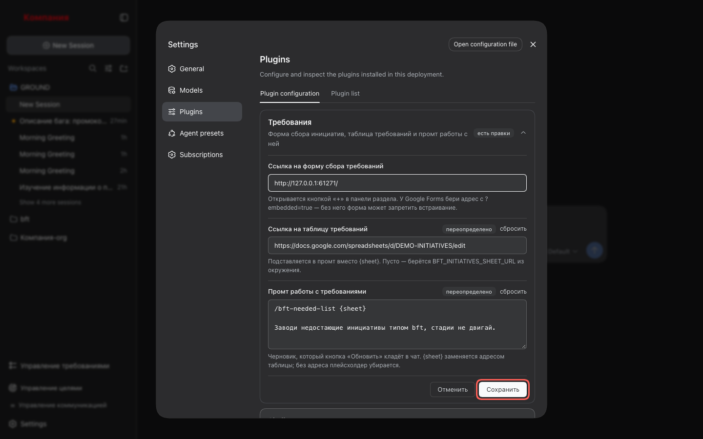
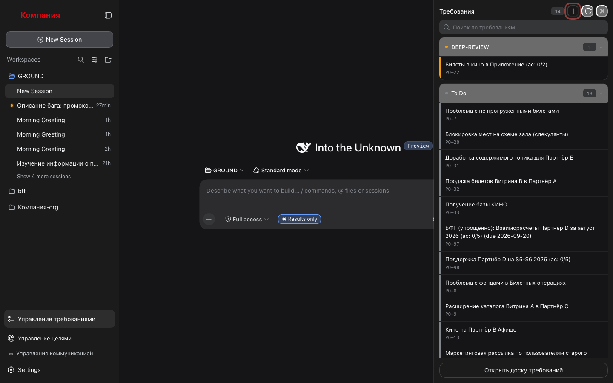
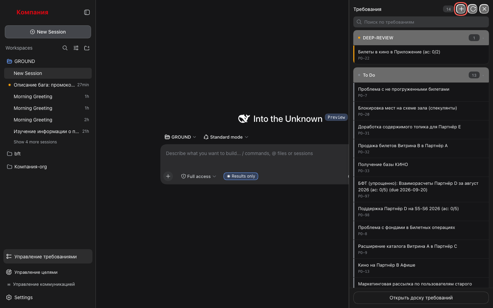
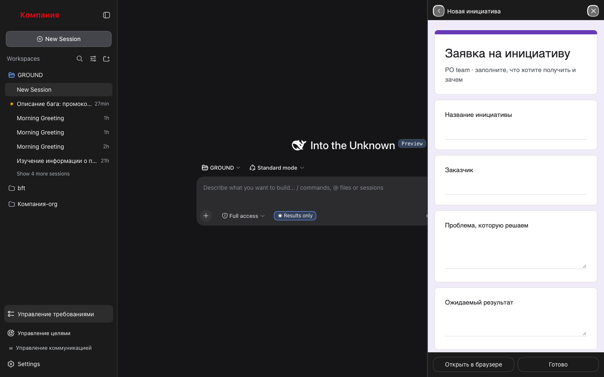
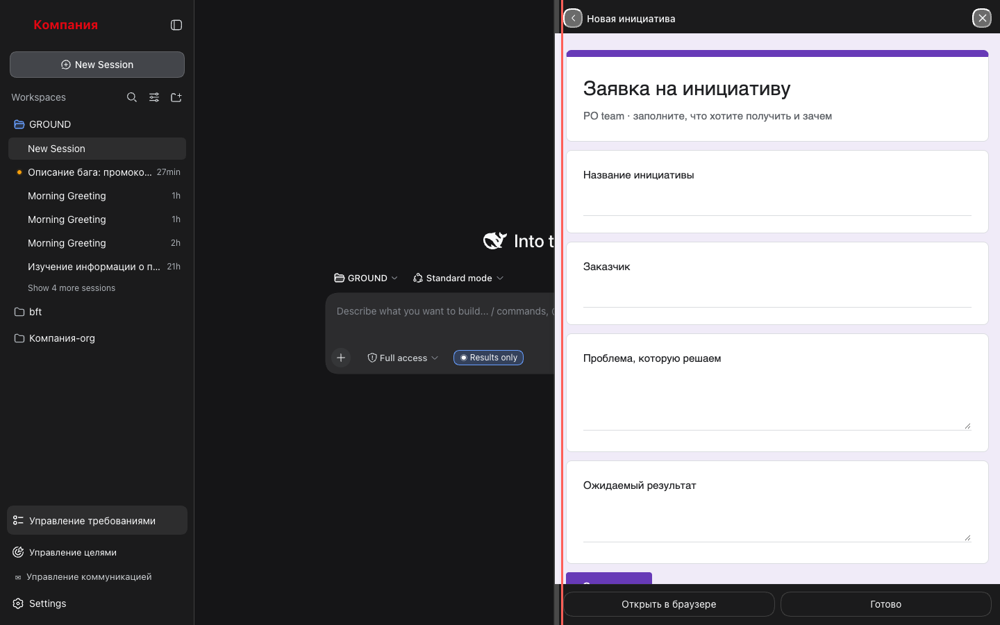
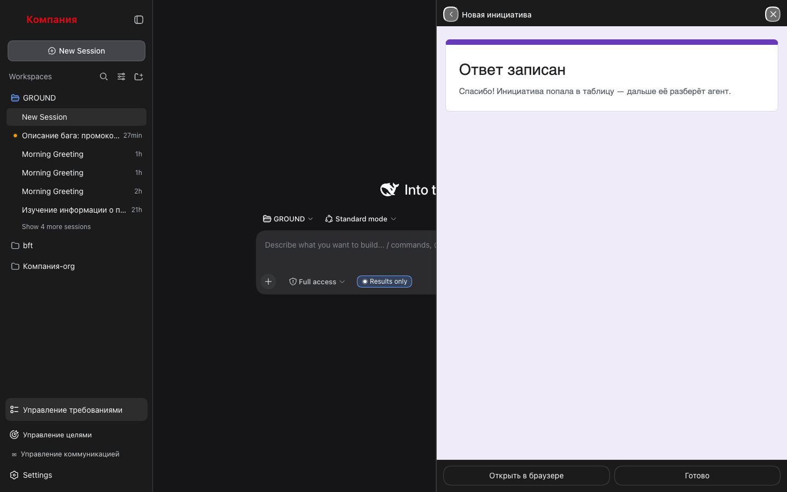
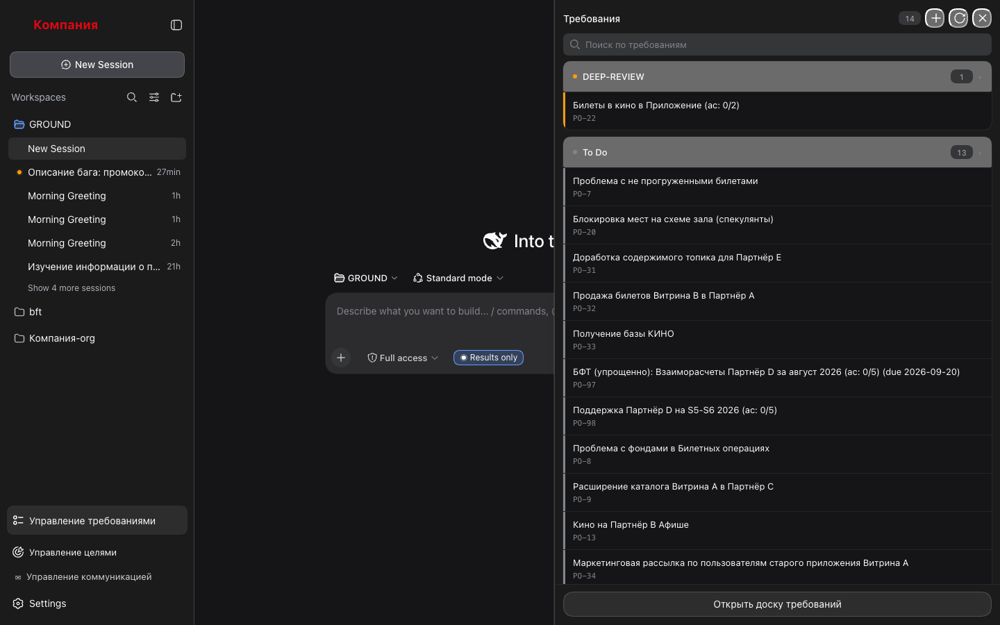
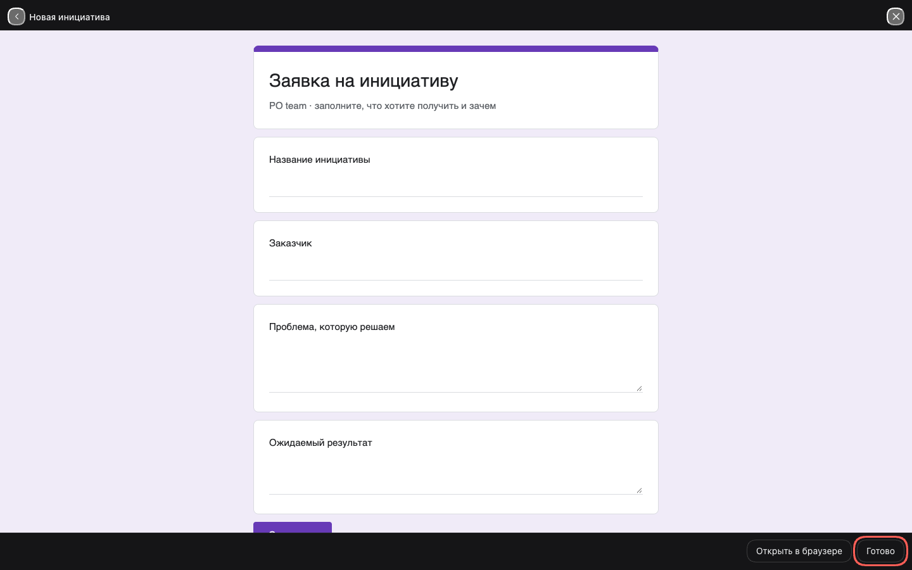
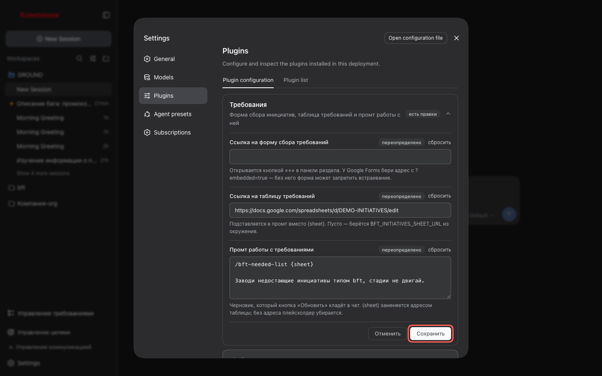

# 6. Форма сбора инициативы

Завести новую инициативу, не уходя из харнесса: форма (Google Forms, корпоративная заявка)
открывается прямо в панели раздела.

## Шаги

### 1. Укажи ссылку на форму

**Настройки → Плагины → «Требования»** → поле **«Ссылка на форму сбора требований»** →
**«Сохранить»**.

Для Google Forms бери адрес с `?embedded=true` — без него форма может запретить
встраивание.

### 2. Нажми «+»

В шапке панели «Требования», слева от «Обновить», кнопка **«+»** («Новая инициатива»).
Пока ссылка не задана, она погашена; подсказка по наведению говорит, где задать.

После настройки кнопка активна.

Нажми — список сменится формой. В шапке: стрелка назад, «Новая инициатива», «Закрыть».

### 3. Сделай панель шире

Потяни левую кромку панели влево. Ширина запоминается и держится после перезагрузки
страницы — и для формы, и для списка.

### 4. Заполни и отправь

Заполни форму и отправь её как обычно. Экран «Ответ записан» покажет сама форма внутри
панели — раздел о нём не узнаёт и узнать не может.

### 5. Нажми «Готово»

**«Готово»** в подвале возвращает к списку и обновляет его. Новая строка появится в
списке не сразу: между формой и списком стоят таблица инициатив и синхронизация
(сценарий 5).

Форма не открылась (адрес не отвечает или страница запрещает встраивание) — в подвале
всегда есть **«Открыть в браузере»**: та же форма в новой вкладке.

### 6. С доски

На доске (сценарий 4) та же форма открывается кнопкой **«Добавить»** — на всю страницу.
«Назад» и «Готово» возвращают на доску.

### 7. Убери ссылку, если форма больше не нужна

В настройках у поля появилась пометка «переопределено» и ссылка **«сбросить»** — нажми её
и **«Сохранить»**. «+» снова погаснет.

## Что стоит знать

- Форма живёт в изолированном фрейме: она не может увести харнесс на другой адрес и не
  получает доступа к его окну. Отправка, скрипты, cookie и всплывающее окно авторизации ей
  разрешены.
- Ссылка проверяется только на схему: `http://` или `https://`. Живёт ли по ней форма —
  узнаешь, открыв её.
- Ссылку стёрли, пока форма открыта, — панель сама вернётся к списку.
