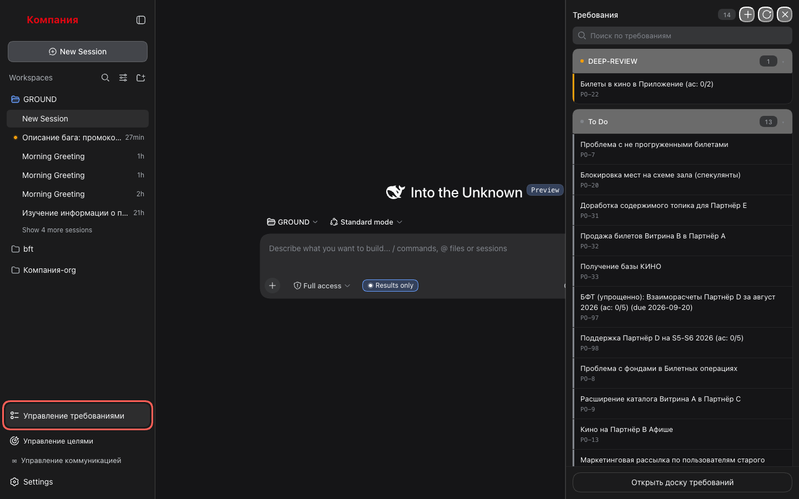

# Плейбуки раздела «Управление требованиями»

Пошаговые инструкции для PO по разделу «Управление требованиями» (`plugin/`, см.
[dsh-plugin-setup.md](../dsh-plugin-setup.md)): что нажать и что увидишь. Скриншоты сняты
с живого харнесса прогоном `pnpm playbook:shots` (см. `plugin/e2e/`) — те же шаги, что в
тексте, в том же порядке.

## Где раздел

Кнопка **«Управление требованиями»** в подвале левой панели харнесса. Открывает панель
«Требования» у правого края — с неё начинаются все сценарии ниже.

## Сценарии

| # | Сценарий | Что покрывает |
|---|---|---|
| 1 | [Список требований](01-requirements-list.md) | Открыть панель, группы по стадиям, свернуть группу, поиск |
| 2 | [Превью и работа в чате](02-preview-and-chat.md) | Карточка требования, «Работать в чате» с готовым черновиком |
| 3 | [Детальная страница](03-detail-page.md) | Документ требования, «О задаче», быстрые правки агенту |
| 4 | [Доска по стадиям](04-board.md) | Семь колонок пайплайна, переходы, «Добавить» |
| 5 | [Синхронизация с таблицей инициатив](05-sync.md) | Настройка таблицы и промта, кнопка «Обновить» |
| 6 | [Форма сбора инициативы](06-intake-form.md) | Настройка формы, «+» и «Добавить», ширина панели, «Готово» |

## Про скриншоты

Снимки сделаны с живого рабочего пространства, поэтому перед каждым кадром страница
обезличивается (`plugin/e2e/support/redact.ts` + локальный словарь установки): названия
продуктов и партнёров заменены на «Витрина A», «Партнёр B», «Приложение», фамилии — на
«Сотрудник», ссылки на трекер и вики — на `example.com`, документ требования — на
демонстрационный. Прогон падает, если на кадре остаётся запрещённый фрагмент; текст он
проверяет, картинки и логотипы — нет, их смотрят глазами перед публикацией.

## Что нужно, чтобы всё работало

- Документы требований лежат в `.bft/documentation/<slug>/` — их пишут `/bft-fast` и
  `/bft-deep`, по составу файлов раздел определяет стадию. Без документа детальная страница
  предложит создать его.
- Backlog.md необязателен: без него в разделе не будет задач, заведённых до первого
  `/bft-fast`.
- Настройки раздела — **Настройки → Плагины → «Требования»**: ссылка на форму, ссылка на
  таблицу, промт. Без них список и доска работают, а «+» и подстановка адреса — нет.

## Чего раздел не делает

- **Не отправляет ничего в чат сам.** Каждая кнопка, ведущая в чат, кладёт черновик в
  композер; Enter жмёшь ты.
- **Не узнаёт, что форму отправили.** Форма — чужая страница; после отправки нажми «Готово».
- **Не читает таблицу инициатив.** Её разбирает агент по промту из настроек.
