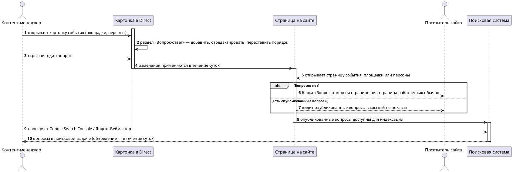

# [БФТ] direct-faq: Блок «Вопрос-ответ» на карточках Direct

> Статус проработки: ✅ Полный БФТ собран (bft-deep). Шапка выше — сутевое описание, ниже — канон MTS.

## Шапка (сутевое описание запроса)

### Цель

| SMART | Значение |
|---|---|
| S (Specific) | Редактируемый блок «Вопрос-ответ» на карточках события, площадки и персоны в Direct: добавление, редактирование, изменение порядка, скрытие вопроса; публикация на сайте |
| M (Measurable) | Обновления на сайте — в течение суток; опубликованные вопросы индексируются поиском (Google Search Console / Яндекс.Вебмастер), скрытые не отображаются |
| A (Achievable) | [УТОЧНИТЬ] — способ реализации на встрече не обсуждали |
| R (Relevant) | Публикация вопросов даёт попадание в поисковую выдачу — SEO-эффект для карточек Direct |
| T (Time-bound) | [УТОЧНИТЬ] — срок реализации не называли; на встрече звучало только время появления правок на сайте (сутки) |

### How to demo

1. Открываю в Direct карточку события (потом площадки, потом персоны) → есть раздел «Вопрос-ответ».
2. Добавляю вопрос, правлю, меняю порядок, один скрываю.
3. Захожу на страницу на сайте → вижу опубликованные вопросы; скрытый не показан.
4. На странице без вопросов блока нет, страница работает как обычно.
5. Проверяю в Google Search Console / Яндекс.Вебмастер, что вопросы попали в поиск (в течение суток обновится).

### Ограничения и договоренности

* Событие, площадка, персона (заполнение от MRS и FAQ для категорий — не входят в зону БФТ)
* Правки на сайте появляются в течение суток

### Общая информация

| Поле | Значение |
| --- | --- |
| Название проекта | Блок «Вопрос-ответ» на карточках Direct |
| Ответственный за продукт | Анастасия Яковлева |
| Ответственный за документ | [УТОЧНИТЬ] |
| Задача/Epic Jira | [СОЗДАТЬ эпик] |
| Статус | АНАЛИЗ |
| Системные требования | [УТОЧНИТЬ] |


Проблема которую решаем
=======================

| Срез | Содержание |
| --- | --- |
| **ДЛЯ КОГО** | Контент-менеджер Direct, посетитель сайта |
| **ЧТО ДЕЛАЕМ** | Добавляем редактируемый блок «Вопрос-ответ» на карточки событий, площадок и персон в Direct, с публикацией на сайте и попаданием в поисковую выдачу |
| **ASIS** | `[ASIS не озвучен]` — текущее поведение карточек и страниц на встрече не обсуждалось |
| **ПРОБЛЕМА** | Вопросы покупателей нельзя опубликовать на карточке без релиза, в поиск они не попадают. Измеримая бизнес-боль не названа — `[УТОЧНИТЬ у Анастасии Яковлевой]` |
| **TOBE** | Контент-менеджер ведёт вопросы на карточке без релиза (БТ-1); посетитель видит опубликованные, скрытые не показаны (ИТ-1); вопросы попадают в поиск, изменения на сайте в течение суток (ФТ-1, НФТ-1) |

Изменение в UJM
===============

| Точка демо | Было (As-Is) | Стало (To-Be) |
| --- | --- | --- |
| Карточка события / площадки / персоны в Direct | `[ASIS не озвучен]` | Контент-менеджер открывает раздел «Вопрос-ответ», добавляет, редактирует, переставляет порядок, скрывает вопрос — без релиза |
| Страница события / площадки / персоны на сайте | `[ASIS не озвучен]` | Посетитель видит опубликованные вопросы, скрытый не показан; без вопросов блока на странице нет |
| Поисковая выдача (Google Search Console / Яндекс.Вебмастер) | `[ASIS не озвучен]` | Опубликованные вопросы индексируются, изменения на сайте — в течение суток |

План демонстрации
=================

### Акторы

| Актор | Описание |
| --- | --- |
| Контент-менеджер Direct | Управляет блоком «Вопрос-ответ» на карточке события, площадки, персоны |
| Посетитель сайта | Видит опубликованные вопросы на странице события, площадки, персоны |
| Поисковая система (Google / Яндекс) | Индексирует опубликованные вопросы; статус проверяется в Search Console / Вебмастере |

### Сценарий приёмки (happy path + alt)



Атрибутивный состав сообщений (параметры и типы запросов/ответов) не входит в БФТ — зона СА / системных требований.

**Расширенный сценарий приёмки (ось «что если», стресс happy path):**

| What-if | Есть источник? | Результат |
| --- | --- | --- |
| Контент-менеджер меняет порядок вопросов после публикации | Да — Summary («поменять порядок») | Покрыто TOBE → БТ-1, ПТ-1, НФТ-1 (изменение на сайте — в течение суток) |
| На карточке скрыты все вопросы разом | Частично — по аналогии с «вопросов нет» (Summary) | Трактовка «все скрыты = блока нет» на встрече не подтверждена — `[УТОЧНИТЬ у Анастасии Яковлевой]` |
| Вопрос или ответ содержит некорректный либо вредоносный текст | Нет | `[УТОЧНИТЬ у Анастасии Яковлевой]` — модерация контента не обсуждалась (см. ФТ-2) |
| Карточка события/площадки/персоны удаляется или архивируется вместе с блоком | Нет | `[УТОЧНИТЬ у Дмитрия Ананьева]` — поведение блока при удалении/архивации карточки не обсуждалось (см. ФТ-3) |
| Поисковая система не проиндексировала вопросы за сутки | Нет | `[УТОЧНИТЬ у Дмитрия Ананьева]` — индексация сторонним поисковиком вне контроля продукта, SLA попадания в выдачу не обсуждался (см. «Риски») |
| Два контент-менеджера редактируют один блок одновременно | Нет | `[УТОЧНИТЬ у Дмитрия Ананьева]` — конкурентное редактирование не обсуждалось (см. НФТ-2) |

Бизнес-Требования
=================

## Ценность разрабатываемого функционала для бизнес-заказчиков*

| Идентификатор | Наименование требования | Ценность разрабатываемого функционала для бизнес-заказчиков | Краткое описание доработки из данного БФТ | Связанные требования |
| --- | --- | --- | --- | --- |
| БТ-1 | Самостоятельное управление блоком «Вопрос-ответ» | Контент-менеджер публикует и меняет вопросы без релиза; опубликованные вопросы индексируются поисковыми системами — целевая метрика эффекта `[УТОЧНИТЬ у Анастасии Яковлевой]` | Раздел «Вопрос-ответ» на карточках события, площадки, персоны в Direct: добавление, редактирование, порядок, скрытие вопроса; публикация на сайте и в поиске | ПТ-1, ПТ-2, ФТ-1, ФТ-2, ФТ-3 |

Пользовательские требования*
============================

| Идентификатор | Наименование требования | Story | Комментарий | Связанные требования |
| --- | --- | --- | --- | --- |
| ПТ-1 | Управление вопросами на карточке | **Когда** я (контент-менеджер Direct) работаю с карточкой события, площадки или персоны **Я хочу** добавить, отредактировать, переставить порядок и скрыть вопрос **Чтобы** публиковать актуальные ответы без обращения к разработке | Изменение применяется на сайте в течение суток (НФТ-1) | БТ-1 |
| ПТ-2 | Просмотр вопросов на сайте | **Когда** я (посетитель сайта) открываю страницу события, площадки или персоны **Я хочу** видеть опубликованные вопросы и не видеть скрытые **Чтобы** получить ответ на вопрос сразу на странице | Если вопросов нет — блока на странице нет, остальное работает как обычно (Summary) | БТ-1 |

Требования к интерфейсам*
=========================

| Идентификатор | Наименование требования | Требование к пользовательскому интерфейсу | Предложения по элементам UI, механике и композиции | Связанные требования |
| --- | --- | --- | --- | --- |
| ИТ-1 | Блок «Вопрос-ответ» на странице сайта | Опубликованные вопросы видны посетителю; скрытый вопрос не показан; при отсутствии вопросов блока на странице нет, остальное работает как обычно | `[УТОЧНИТЬ]` — макет не обсуждался | ПТ-2 |
| ИТ-2 | Управление вопросами в Direct | Контент-менеджер видит раздел «Вопрос-ответ» на карточке события, площадки, персоны; доступны действия: добавить, отредактировать, переставить порядок, скрыть вопрос | `[УТОЧНИТЬ]` — макет админки не обсуждался | ПТ-1 |

## Макеты интерфейса*

`[УТОЧНИТЬ — готовы ли макеты для раздела «Вопрос-ответ» в Direct и для блока на витрине сайта; дизайн на встрече не обсуждался]`.

Функциональные требования*
==========================

| Идентификатор | Наименование требования | Приоритет | Функциональные требования | Параметры, ограничения | Связанные требования |
| --- | --- | --- | --- | --- | --- |
| ФТ-1 | Индексация опубликованных вопросов | Высокий | Опубликованные вопросы попадают в поисковую выдачу (Google Search Console / Яндекс.Вебмастер фиксируют индексацию) | Доступность для индексации — в течение суток после публикации (НФТ-1) | БТ-1, ПТ-2 |
| ФТ-2 | Модерация и санитизация контента вопроса | Средний (предварительно) | Правило проверки текста вопроса и ответа перед публикацией на сайте не определено — сюда же входит санитизация текста | `[УТОЧНИТЬ у Анастасии Яковлевой]` — нужна ли модерация; `[УТОЧНИТЬ у Дмитрия Ананьева]` — состав санитизации | БТ-1, ПТ-1, ИТ-1 |
| ФТ-3 | Поведение блока при удалении/архивации карточки | Средний (предварительно) | Судьба блока «Вопрос-ответ» при удалении или архивации карточки события, площадки, персоны не обсуждалась | `[УТОЧНИТЬ у Дмитрия Ананьева]` | БТ-1, ИТ-1 |
| ФТ-4 | Конкурентное редактирование блока | Низкий (предварительно) | Поведение при одновременном редактировании блока несколькими пользователями Direct не обсуждалось на встрече | `[УТОЧНИТЬ у Дмитрия Ананьева]` | БТ-1, ПТ-1 |

Нефункциональные требования*
============================

| Идентификатор | Наименование требования | Описание | Связанные требования |
| --- | --- | --- | --- |
| НФТ-1 | Задержка публикации изменений | Изменения в блоке «Вопрос-ответ» (добавление, редактирование, порядок, скрытие) появляются на сайте в течение суток после сохранения в Direct [Summary: «Обновление на сайте — в течение суток»] | ФТ-1, ПТ-1 |

Других измеримых порогов (нагрузка, латентность, объём) на встрече не звучало — не выдумываются. Поведенческие пробелы (модерация и санитизация, конкурентное редактирование) — не НФТ: они описывают поведение системы, поэтому живут в ФТ-2 и ФТ-4.

Зависимости
===========

| Команда / система | Тип зависимости | Статус согласования |
| --- | --- | --- |
| Поисковые системы (Google Search Console, Яндекс.Вебмастер) | Индексация опубликованных вопросов | Внешняя зависимость, вне зоны БФТ; условия индексации сторонним поисковиком не согласовывались — `[УТОЧНИТЬ]` |
| Разработка (Дмитрий Ананьев) | Реализация блока «Вопрос-ответ» в Direct и на витрине сайта | Технические развилки реализации не выбраны — `[УТОЧНИТЬ у Дмитрия Ананьева]` |
| PO площадок (Анастасия Яковлева) | Приёмка блока «Вопрос-ответ» и решение по метрике эффекта | Ожидает ответа — `[УТОЧНИТЬ у Анастасии Яковлевой]` |

Риски
=====

Строки заводятся только из шестого среза аудита и только после подтверждения PO (ЗМ-023). На этом прогоне PO подтвердил один организационный риск; технические риски реализации — индексация сторонним поисковиком, модерация контента, конкурентное редактирование — в раздел не идут: они живут в ФТ и в alt-ветках сценария приёмки.

| Риск | Вероятность | Влияние | Митигация |
| --- | --- | --- | --- |
| Состав технических развилок реализации блока не определён, оценка и слот разработки не подтверждены | Средняя | Высокое | Дмитрий Ананьев собирает развилки и даёт оценку до старта спринта; подтверждено PO на созвоне 08.07.2026 |

Якоря истины
============

| Факт в БФТ | Источник (якорь) | Ранг | Тип |
| --- | --- | --- | --- |
| Раздел «Вопрос-ответ» на карточках события/площадки/персоны: добавить, отредактировать, поменять порядок, скрыть | Summary §Что делаем, созвон 03.07.2026 (`skills/bft-fast/examples/golden_summary.md`) | R3 | Решение/утверждение на встрече |
| Опубликованные вопросы видны на сайте, скрытый не показан | Summary §Что делаем | R3 | Решение/утверждение на встрече |
| Нет вопросов — блока на странице нет, страница работает как обычно | Summary §Что делаем | R3 | Решение/утверждение на встрече |
| Обновление на сайте — в течение суток | Summary §Что делаем, §Договорённости | R3 | Решение/утверждение на встрече |
| Вопросы должны попадать в поиск (Google Search Console / Яндекс.Вебмастер) | Summary §Что делаем | R3 | Решение/утверждение на встрече |
| Границы: событие, площадка, персона; заполнение от MRS и FAQ для категорий не входят | Summary §Договорённости | R3 | Решение/утверждение на встрече |
| Кнопка «Вернуть» на билете TicketsCloud уводит на сайт TicketsCloud — требует подтверждения | Summary §Открытые точки | — | `[УТОЧНИТЬ у Анастасии Яковлевой]` |
| Формулировки статуса возврата «возврат оформляется» → «возвращён» | Summary §Открытые точки | — | `[УТОЧНИТЬ у Анастасии Яковлевой]` |
| Невозвратный билет — надпись вместо кнопки | Summary §Открытые точки | — | `[УТОЧНИТЬ у Анастасии Яковлевой]` |
| Что показывать до подтверждения возврата покупателем | Summary §Открытые точки | — | `[УТОЧНИТЬ у Анастасии Яковлевой]` |
| Требования к метрикам кроме функционала | Summary §Открытые точки | — | `[УТОЧНИТЬ у Анастасии Яковлевой]` |
| Технические развилки реализации блока | Summary §Открытые точки | — | `[УТОЧНИТЬ у Дмитрия Ананьева]` |
| Модерация контента вопроса/ответа | не обсуждалось на встрече | — | `[УТОЧНИТЬ у Анастасии Яковлевой]` |
| Поведение блока при удалении/архивации карточки | не обсуждалось на встрече | — | `[УТОЧНИТЬ у Дмитрия Ананьева]` |
| Конкурентное редактирование блока | не обсуждалось на встрече | — | `[УТОЧНИТЬ у Дмитрия Ананьева]` |
| Безопасность контента (санитизация вопроса/ответа) | не обсуждалось на встрече | — | `[УТОЧНИТЬ у Дмитрия Ананьева]` |

## Продолжить / уточнить БФТ

Канон MTS собран (bft-deep, 08.07.2026). Открытые точки помечены `[УТОЧНИТЬ]` в ячейках требований; список вопросов к PO ушёл ответом в чат. Промт ниже — чтобы продолжить проработку в чистой сессии Claude Code.

<details>
<summary>▶ Уточнить и обновить БФТ — промт для Claude Code (скопируй в свою сессию)</summary>

```text
Ты — обогатитель БФТ (роль bft-deep-swarm, «Обогатитель»). Перед тобой документ БФТ:
шапка (bft-fast) заморожена, канон MTS уже собран (bft-deep). Часть фактов канона
помечена [УТОЧНИТЬ у {кого}] — закрой их по ответам PO/разработки и обнови документ,
НЕ ПЕРЕПИСЫВАЯ шапку и не перенумеровывая существующие ID канона.

ЧТО СДЕЛАТЬ:
1. Шапку и уже собранный канон ниже границы сохрани; правь только строки/ячейки,
   где стоит [УТОЧНИТЬ] или появился новый ответ.
2. Новый факт без источника — снова [УТОЧНИТЬ у {кого}], не выдумывай.
3. Новые ID добавляй в конец соответствующей типизированной таблицы канона, старые
   ID не перенумеровывай.
4. Разделы канона не добавляй сверх одиннадцати: Проблема которую решаем → Изменение
   в UJM → План демонстрации → Бизнес-Требования → ПТ → ИТ → ФТ → НФТ → Зависимости →
   Риски → Якоря истины. «Бизнес описание», «Общая информация», «Заинтересованные
   стороны», «История изменений», «Дополнительные материалы», «Ревью требований»
   в документе не заводятся.

ПЕРЕД СОХРАНЕНИЕМ:
    python3 .claude/skills/bft-writer/scripts/bft-lint.py <путь-к-этому-документу>
Ненулевой код выхода = структура сломана. Исправь и прогони снова; документ с ошибками
линтера не сохраняется и не публикуется.

КОНТЕКСТ ЭТОГО БФТ:
- epic_slug: direct-faq
- Источник Summary: skills/bft-fast/examples/golden_summary.md
- Confluence: не опубликовано
- pin_commit (репо poh-bft-writer): [hash прогона]
- Открытые точки: ячейки с `[УТОЧНИТЬ]` в таблицах требований.

КАК ЗАПУСТИТЬ:
- Если установлен poh-bft-writer: /bft-deep <путь-к-этому-документу>
- Иначе: скопируй ВЕСЬ этот документ в Claude Code и выполни инструкцию выше.
```

</details>
