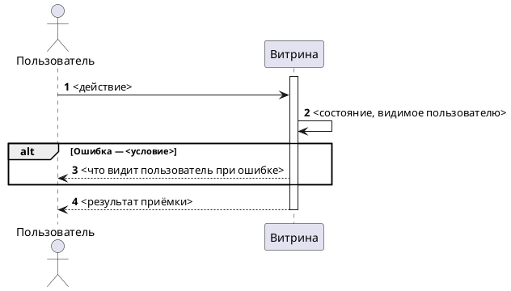

<!--
ideal_bft.md — пустой шаблон КАНОНА БФТ (области ниже строки-границы BFT-HEAD-END
единого документа). Заполнять СТРОГО по разделам, порядок фиксирован (ЗМ-005/ЗМ-016) —
не менять. Канон начинается с «Проблема которую решаем» и состоит из 11 разделов.
В каноне НЕТ разделов «Бизнес описание», «Общая информация», «Заинтересованные стороны»,
«История изменений», «Дополнительные материалы», «Ревью требований», «Границы»,
«Критерии успеха», «Ключевые решения» (ЗМ-016): образ результата, карточка проекта,
персоны, источники и договорённости по объёму живут в ШАПКЕ документа выше границы
(bft-fast/resources/document_assembly.md). Объём читается из блока «Цель» шапки + строк
ДЛЯ КОГО/ЧТО ДЕЛАЕМ в «Проблеме»; строки «Скоуп документа —» НЕ вставлять (ЗМ-014).
Границы/критерии/As-Is-Gap — рабочие артефакты стадии решения (problem.md, concept.md).
Плейсхолдеры <...> заменять реальными значениями или [УТОЧНИТЬ].
Frontmatter — только машиночитаемая шапка из десяти ключей; НЕ вносить внутренние пути
инструмента (artefacts/, .bft/index/, context_map.md, validation.md) — это утечка лесов.
Ссылки Jira/Confluence (ЗМ-004, ЗМ-009, ЗМ-012): markdown-ссылка ТОЛЬКО на существующую
страницу, на КАЖДОМ вхождении в каждой колонке/абзаце. Линкуются и JIRA-проекты
(/projects/{PROJECT}), и Confluence-пространства (/display/{SPACE}), не только ключи задач.
Цель — клик из документа, без поиска снаружи. BR-*/US#N не линкуются.
Нет объекта (эпик не создан) → не ссылка, а [УТОЧНИТЬ]/пометка без URL, не битая ссылка.
При публикации в Confluence (/bft-deliver) ссылки становятся макросами для превью.
Структура проверяется машинно: python3 <skills_path>/bft-writer/scripts/bft-lint.py <документ> (гейт 17).
-->
<!-- Пример «нет объекта»: эпик ещё не создан → пиши `[СОЗДАТЬ эпик]` (без URL), не выдуманную ссылку. -->
<!-- Шапка документа (frontmatter, H1, блоки Цель / How to demo /
     Ограничения и договоренности / Документация / Общая информация)
     и строка-границы BFT-HEAD-END задаются bft-fast — здесь не дублируются.
     Эталон целого документа: ../../bft-deep-swarm/examples/golden_deep_document.md -->

## Проблема которую решаем

<Таблицей, НЕ текстом (ЗМ-002). Строки ДЛЯ КОГО / ЧТО ДЕЛАЕМ / ASIS (с якорями R1/R2) / ПРОБЛЕМА (бизнес-разрыв) / TOBE (целевое, не якорить на код).
ФОРМАТ ЯЧЕЕК (ЗМ-021): ячейка — одна короткая формулировка, без HTML-разметки. Теги `<ul>`, `<li>`, ` ` не использовать вовсе. Несколько пунктов не верстаются списком, а сжимаются в одну фразу через запятую или точку с запятой; не влезает — значит формулировка длинная, а не ячейка тесная.
ДЛЯ КОГО — только сегменты, через запятую: «МТС.Медиа, CTO кластера МТС.Медиа». Не расписывать, кто за что отвечает и почему — зона ответственности живёт в `personas.csv`.>

| Срез | Содержание |
| --- | --- |
| **ДЛЯ КОГО** | <сегменты через запятую> |
| **ЧТО ДЕЛАЕМ** | <одно предложение сути доработки> |
| **ASIS** | <текущее поведение одной строкой> ([JIRA KEY](https://jira.mts.ru/browse/KEY)) |
| **ПРОБЛЕМА** | <в чём боль для бизнеса и в чём разрыв — одной фразой> |
| **TOBE** | <целевое поведение, кратко; ссылки на ID в скобках> |

## Изменение в UJM

<Что и где меняется на пути пользователя, на уровне приёмки (без технических деталей).>

| Точка демо | Было (As-Is) | Стало (To-Be) |
| --- | --- | --- |
| <экран / сценарий> | <как сейчас> | <как станет> |

## План демонстрации

### Акторы

| Актор | Описание |
| --- | --- |
| <Пользователь / Контент-менеджер> | <Роль> |
| <Витрина / Админка> | <Роль> |

### Сценарий приёмки (happy path + alt)

Сценарий на уровне актор → действие → результат. PlantUML — actor-level / black-box: акторы и витрина, без вызовов между внутренними сервисами и без имён сообщений/API. При публикации блок рендерится **картинкой-вложением** (`<ac:image>`, по умолчанию; макрос «PlantUML» — опционально при плагине), чтобы диаграмма отображалась визуально, а не как код (ЗМ-015).

Атрибутивный состав сообщений (параметры и типы запросов/ответов) не входит в БФТ — зона СА / системных требований.

## Бизнес-Требования

## Ценность разрабатываемого функционала для бизнес-заказчиков*

<Только таблица. Вводных абзацев, перечней «ценностных вопросов» и рассуждений о метриках здесь нет — открытые вопросы живут во «Вводных» выше (ЗМ-019).>

| Идентификатор | Наименование требования | Ценность разрабатываемого функционала для бизнес-заказчиков | Краткое описание доработки из данного БФТ | Связанные требования |
| --- | --- | --- | --- | --- |
| БТ-1 | <Название> | <Безопасность / Устранение SPOF / Сокращение TTM / Рост SEO / …> | <Что реализуется> | ПТ-1, ФТ-1, [<PROJECTKEY-XXX>](https://jira.mts.ru/browse/<PROJECTKEY-XXX>) |

## Пользовательские требования*

| Идентификатор | Наименование требования | Story | Комментарий | Связанные требования |
| --- | --- | --- | --- | --- |
| ПТ-1 | <Название> | **Когда** я (<актор>) <действие> **Я хочу** <результат> **Чтобы** <обоснование> | <опц.> | БТ-1 |

## Требования к интерфейсам*

<Только таблица. Описание продукта, платформ и браузеров абзацем перед ней не выводится — платформенные ограничения идут строкой ИТ, неизвестное → `[УТОЧНИТЬ]` в ячейке + вопрос человеку (ЗМ-019, ЗМ-020). ИТ описывает интерфейс приёмки: что видит и может сделать актор. Не API-контракт (эндпоинты, протоколы, схемы запросов — зона СА).>

| Идентификатор | Наименование требования | Требование к пользовательскому интерфейсу | Предложения по элементам UI, механике и композиции | Связанные требования |
| --- | --- | --- | --- | --- |
| ИТ-1 | <Экран / точка приёмки> | <Что видит актор, какие действия доступны, состояние> | <опц.: элементы, механика, композиция> | ПТ-1 |
| ИТ-2 | <Доступность / адаптив> | <Платформа, разрешение, поведение при ошибке на экране> | <опц.> | ПТ-1 |

## Макеты интерфейса*

<Ссылки на макеты: Figma — <название кадра>. Макет экрана в Direct — [УТОЧНИТЬ: готов ли макет, дизайн — <ФИО>].>

## Функциональные требования*

| Идентификатор | Наименование требования | Приоритет | Функциональные требования | Параметры, ограничения | Связанные требования |
| --- | --- | --- | --- | --- | --- |
| ФТ-1 | <Название> | Высокий | <Поведение системы на уровне результата> | <TTL, идемпотентность, ограничения> | БТ-1, ПТ-1 |

## Нефункциональные требования*

<Только измеримое и подтверждённое. Нет требования — писать «нет явных требований», не выдумывать окно/порог. Приоритет — брать из корпоративного реестра НФТ, если есть.>

| Идентификатор | Наименование требования | Описание | Связанные требования |
| --- | --- | --- | --- |
| НФТ-1 | Латентность чтения | <≤ 200 мс блок / ≤ 100 мс API> | ФТ-1 |
| НФТ-2 | Идемпотентность | Повторный вызов/прогон не выполняет бизнес-логику повторно | ФТ-1 |
| НФТ-3 | Безопасность контента | <санитизация, whitelist, защита от XSS> | ФТ-1, ИТ-1 |
| НФТ-4 | Нагрузка | <5000 читателей, пик 18–22 МСК, 2000+ страниц> (предварительно) | ФТ-1 |
| НФТ-5 | Логирование / аудит | <состав событий>, без чувствительных данных, сквозной trace-id | ФТ-1 |

## Зависимости

| Команда / система | Тип зависимости | Статус согласования |
| --- | --- | --- |
| <Команда / система> | <API / данные / UI / согласование> | Подтверждено / Требует согласования |

## Риски

<Организационные и управленческие риски ведения этой фичи: чей ресурс не подтверждён, какое согласование не получено, какая смежная команда не дала обязательства, что ломает срок или объём. НЕ технические риски реализации (нагрузка, отказ сервиса, миграция) — это зона СА, здесь их нет.

Каждая строка проходит через PO: LLM формулирует риск как гипотезу и выносит её на согласование в диалог, а в документ попадают только подтверждённые. Неподтверждённый риск в таблицу не пишется вовсе — ни с пометкой, ни «на всякий случай»: выдуманный риск дороже пропущенного, потому что его начинают митигировать (ЗМ-023).>

| Риск | Вероятность | Влияние | Митигация |
| --- | --- | --- | --- |
| <Организационный риск, подтверждённый PO> | Низкая/Средняя/Высокая | Низкое/Среднее/Высокое | <Кто и что делает, чтобы риск не сработал> |

## Якоря истины

<Служебный раздел трассировки для PO/аналитика: каждый факт БФТ → источник и ранг. Неподтверждённые факты помечены `[УТОЧНИТЬ]` в своей ячейке; сам вопрос уходит в диалог с PO, а не в документ (ЗМ-020). Ссылки Jira/Confluence — markdown-ссылкой (ЗМ-004).>

| Факт в БФТ | Источник (якорь) | Ранг | Тип |
| --- | --- | --- | --- |
| <факт> | [<PROJECTKEY-XXX>](https://jira.mts.ru/browse/<PROJECTKEY-XXX>) / решение PO от {дата} / ТЗ § | R1/R2/R3 | JIRA / Confluence / BR / Решение PO |

<!-- ## Adversarial Review — заполняется на Стадии 6 команды /bft-gen -->
