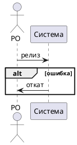

# [БФТ] TEST-1: Фикстура на AI-слоп

> Статус проработки: черновик

## Шапка (сутевое описание запроса)

Цель: проверить, что линтер ловит стоп-слова, хеджи и интенсификаторы.

### How to demo

Не применимо — служебная фикстура.

### Ограничения и договоренности

Сервис обеспечивает хранение медиа и осуществляет их раздачу. Это позволяет
сократить время выкладки.

### Критичные требования (скелет на цитатах)

| ФИО | Роль | Влияние |
|---|---|---|
| Тест Тестов | PO | Тест |

| ID | ASIS (сейчас) | TOBE (после) | Связанные | Источник (цитата) |
|---|---|---|---|---|
| БТ-1 | нет | есть | TEST-1 | «тест» |

### Общая информация

Служебная фикстура для test-bft-style-lint.sh.

<!-- BFT-HEAD-END -->

## Проблема которую решаем

В данном разделе рассматривается проблема медленной выкладки. Важно отметить,
что текущий процесс производит лишние ручные шаги. В настоящее время релиз
занимает сутки.

Способствует росту издержек то, что в случае возникновения ошибки откат
осуществляется вручную. С целью снижения рисков внедряется автоматизация.

Как правило, обновления выкатываются раз в спринт, хотя может потенциально
понадобиться чаще. В некоторых случаях требуется хотфикс.

Крайне важно ускорить процесс: это абсолютно необходимо для команды. Решение
представляет собой совершенно уникальный подход, который действительно
критичен для бизнеса. Нужно полностью завершить миграцию.

Начнём с рассмотрения текущей архитектуры. Ниже описаны шаги миграции.

Leverage существующей инфраструктуры и utilize имеющиеся ресурсы даст
synergistic-эффект — это настоящий game-changer для next-generation платформы.
Решение empowers команду.

## Изменение в UJM

| Актор | Было | Стало |
|---|---|---|
| PO | ручной релиз | автоматический релиз |

## План демонстрации

## Бизнес-Требования

### Вводные для разрабатываемого функционала*

Нет открытых вопросов.

### Ценность разрабатываемого функционала для бизнес-заказчиков*

Сокращение времени релиза.

## Пользовательские требования*

Не применимо.

## Требования к интерфейсам*

Не применимо.

## Функциональные требования*

| ID | Требование | Приоритет | Связанные |
|---|---|---|---|
| ФТ-1 | Автоматический релиз | Высокий | TEST-1 |

## Нефункциональные требования*

| ID | Требование | Приоритет | Связанные |
|---|---|---|---|
| НФТ-1 | Релиз ≤ 10 минут P95 | Высокий | TEST-1 |

## Зависимости

Нет.

## Риски

Нет.

## Якоря истины

| Факт | Источник |
|---|---|
| Релиз занимает сутки | PO |

## Продолжить / уточнить БФТ

Фикстура финализирована.
